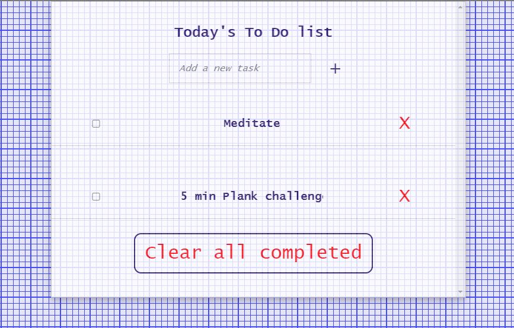

# My-To-do-list

> This is a minimalist and simple To Do list.  It simply lists the things needed to do and allows  to mark them as complete.

Additional description about the project and its features.

## Built With

- HTML
- CSS3
- javaScript
- Webpack

## Live Demo

[Live Demo Link](https://algerina.github.io/My-to-do-list/dist)

## Getting Started

**To get a local copy up and running follow these simple example steps:
- Clone the repo to your computer.
- Run "npm install" to make webpack works.
- Open ./dist/index.html in your browser.**

## Author

👤 **AmelKhiri**

- GitHub: [@Algerina](https://github.com/Algerina)
- LinkedIn: [Amel Khiri](https://linkedin.com/in/amel-khiri-qahwadji-37a550135)

## 🤝 Contributing

Contributions, issues, and feature requests are welcome!

Feel free to check the [issues page](https://github.com/algerina/My-To-do-list/issues).

## Show your support

Give a ⭐️ if you like this project!

## Acknowledgments

- Hat tip to anyone whose code was used
- Inspiration
- etc

## 📝 License

This project is [MIT](./MIT.md) licensed.
